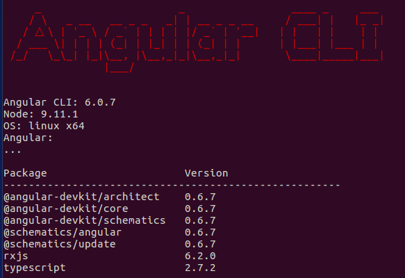

# Angular6-SEO
Example of a simple app using Angular6 with SEO-Friendly tools.

## Description

#### Environment
Type the next command and check you have at least the following configuration:
```
ng -v
```



Build and try the app:
```
ng serve -o
```

## Special Thanks
This material was provided by Gary Simon at https://coursetro.com/posts/code/155/Angular-6-SEO-Tutorial-from-Scratch---It's-Super-Simple-Now!

## Author
**Raúl González Cruz**
>*Computer Systems Engineering, UDLAP*
